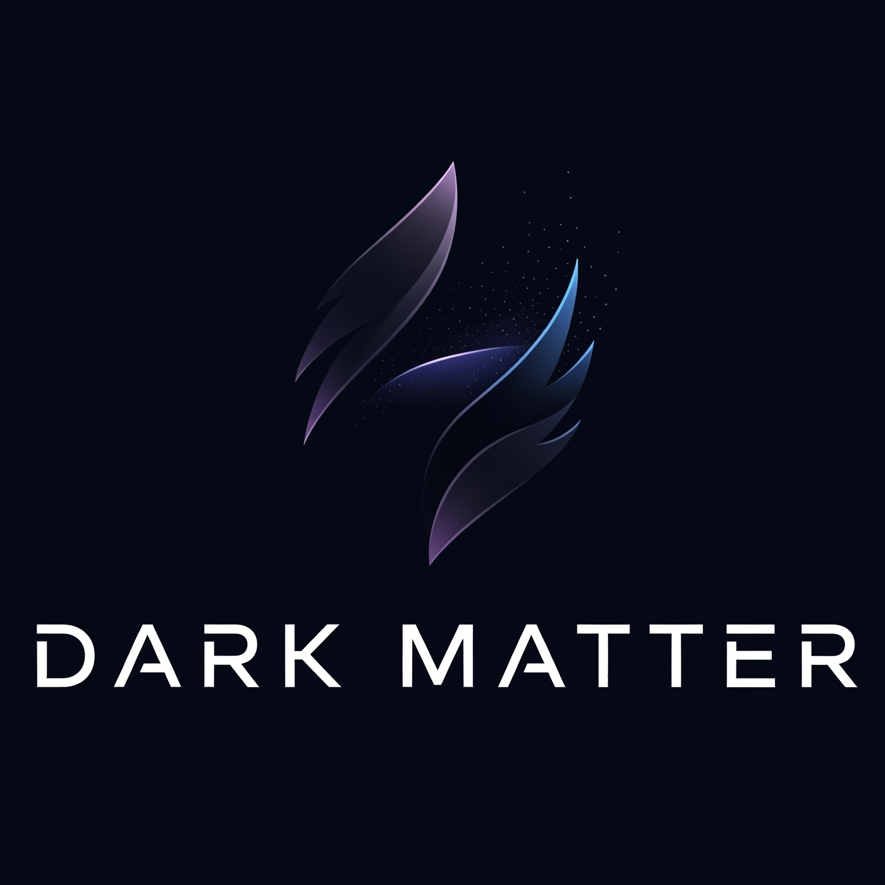

# Dark Matter JS Game Engine

<p align="center">
  
  <br>
  <em>A powerful, component-based 2D/3D game engine for the web with visual editor.</em>
</p>

<p align="center">
  <a href="#features">Features</a> •
  <a href="#getting-started">Getting Started</a> •
  <a href="#documentation">Documentation</a> •
  <a href="#examples">Examples</a> •
  <a href="#recent-updates">Recent Updates</a>

🌐 https://horrelltech.github.io/Dark-Matter-JS---Game-Engine/

## Overview

Dark Matter JS is a comprehensive browser-based game development environment with an integrated visual editor and runtime engine. Built with modern web technologies, it provides a complete solution for creating, testing, and deploying 2D and 3D games directly in your browser.

The engine follows a component-based architecture similar to popular engines like Unity, making it intuitive for developers familiar with those tools while being accessible to newcomers. With extensive module libraries and visual editing tools, you can create complex games without writing extensive code.

## Features

### Core Engine Features
- **Component-Based Architecture**: Build games using reusable modules and components
- **Scene Management**: Organize your game with a flexible scene system
- **Game Object Hierarchy**: Parent-child relationships between game objects
- **Vector Math**: Built-in 2D/3D vector mathematics for transformations and physics
- **Input System**: Comprehensive keyboard, mouse, and touch input handling
- **Collision Detection**: Advanced collision system with polygon support

### Visual Modules & Effects
- **Metroidvania System**: Complete metroidvania framework with player, tilemap, and camera modules
- **Spline Paths**: Create curved paths with edge generation and perlin texture generation
- **Water Effects**: Puddle/lake module with customizable points and cloud reflections
- **Particle Systems**: Advanced particle effects for visual enhancement
- **Sprite Rendering**: Image and sprite sheet animation support
- **Drawing Modules**: Various drawing tools for shapes, capsules, circles, and more
- **UI Components**: Button, text, and interface elements
- **Lighting System**: Point lights, darkness, and light blockers

### 3D Capabilities
- **3D Rendering**: WebGL-based 3D graphics with custom shaders
- **3D Models**: Support for 3D mesh rendering and manipulation
- **3D Camera**: Multiple camera types including fly camera and orbit controls

### Editor Features
- **Visual Editor**: Create and arrange game objects in a visual scene editor
- **Inspector Panel**: Modify object properties in real-time with extensive customization
- **Hierarchy View**: Manage game objects and their relationships
- **Project Browser**: Organize game assets and scripts
- **Interactive Gizmos**: Drag and edit module points directly in the editor
- **Grid & Snapping**: Precise object placement with customizable grid
- **Zen Mode**: Toggle fullscreen/window mode for distraction-free editing
- **AI Assistant**: Get code help, generate modules, and ask questions directly in the script editor

### Development Features
- **Script Editor**: Write and edit game scripts with syntax highlighting and AI-powered assistance
- **Module System**: Create and manage reusable components with JSON serialization
- **Scene Serialization**: Save and load your game scenes with full state preservation
- **Export System**: Package your games for distribution (HTML5, ZIP formats)
- **Asset Management**: Comprehensive asset loading and management system
- **Mobile Support**: Touch-friendly interface and mobile-optimized controls

## Getting Started

### Prerequisites
- A modern web browser (Chrome, Firefox, Edge, or Safari)
- Basic knowledge of JavaScript and HTML

### Online Editor
The easiest way to get started is by using our online editor:
[Dark Matter Development Environment](https://horrelltech.github.io/Dark-Matter-JS---Game-Engine)

### Local Installation

1. Clone the repository:
```bash
git clone https://github.com/yourusername/Dark-Matter-JS---Game-Engine.git
```

2. Navigate to the project folder:
```bash
cd Dark-Matter-JS---Game-Engine
```

3. Open `index.html` in your browser or set up a local server:
```bash
# Using Python 3
python -m http.server

# Using Node.js
npx http-server
```

4. Access the editor at `http://localhost:8000` or the port specified by your server.

## Documentation

## Zen Mode

Zen Mode provides a distraction-free editing experience by toggling the editor into fullscreen. Click the "Zen Mode" button (moon/sun icon) in the toolbar to enter or exit fullscreen mode. The icon updates to indicate the current state.

## Script Editor & AI Assistant

The Script Editor features syntax highlighting, code formatting, and undo/redo support. It also includes an integrated **AI Assistant** panel, which allows you to:

- **Ask questions about your code or the module system**
- **Generate new modules or scripts**
- **Request code fixes or improvements**
- **Insert generated code directly into your script**

Supported AI providers include ChatGPT (OpenAI), Gemini (Google), and Claude (Anthropic). You can configure your API keys and default provider in the AI settings dialog within the Script Editor.

**How to use the AI Assistant:**
1. Open a script file in the Script Editor.
2. Click the robot icon to open the AI panel.
3. Type your question or request (e.g., "Create a movement module for my player").
4. Choose context buttons to include current code or selection.
5. Send your message and review the AI's response.
6. Insert generated code directly into your script with one click.

### Game Objects
Game objects are the fundamental building blocks in Dark Matter JS. Each game object can have:
- Transformation properties (position, rotation, scale)
- Parent-child relationships
- Multiple modules (components)
- Tags for organization

### Modules
Modules are components that add behavior and functionality to game objects:

#### Built-in Module Categories
- **Metroidvania System**
  - MetroidvaniaPlayer: Advanced 2D player with movement, jumping, wall jumping, and abilities
  - MetroidvaniaTilemap: 2D tile-based world with collision detection and room management
  - MetroidvaniaCamera: Room-based camera with smooth transitions and dead zones

- **Visual & Graphics**
  - SpriteRenderer: Renders images and sprite sheet animations
  - SplinePath: Creates curved paths with edge generation and perlin textures
  - PuddleLake: Water effects with customizable points and cloud reflections
  - ParticleSystem: Advanced particle effects and emitters
  - Drawing modules: Shapes, capsules, circles, and procedural backgrounds

- **User Interface**
  - Button: Customizable UI buttons with click actions
  - Text: Text rendering and formatting

- **Physics & Movement**
  - PlatformCharacterAuto: Advanced platform character with realistic physics
  - BasicPhysics: Simple physics simulation
  - KeyboardController: Input-based movement control

- **3D Graphics**
  - 3D rendering with WebGL support
  - 3D models and mesh rendering
  - Multiple camera types and lighting

- **Audio**
  - AudioPlayer: Sound effect and music playback

- **Effects & Lighting**
  - PointLight: Dynamic lighting system
  - Darkness: Darkness and shadow effects
  - PostScreenEffects: Screen-space visual effects

#### Custom Modules
- Create your own modules by extending the Module class
- Expose properties for the inspector with full gizmo support
- Implement lifecycle methods (preload, start, loop, etc.)
- Full JSON serialization support for scene persistence

### Lifecycle Methods
When creating custom modules, you can implement these methods:
- `preload()`: Called before the game starts, used for loading assets
- `start()`: Called when the module is first activated
- `beginLoop()`: Called at the beginning of each frame
- `loop(deltaTime)`: Called every frame with the time since last frame
- `endLoop()`: Called at the end of each frame
- `draw(ctx)`: Called when the module should render
- `onDestroy()`: Called when the module is being destroyed

## Examples

### Creating a Simple Game Object
```javascript
// Create a new game object
const player = new GameObject("Player");
player.position = new Vector2(400, 300);

// Add it to the scene
scene.gameObjects.push(player);
```

### Creating a Custom Module
```javascript
class PlayerController extends Module {
    constructor() {
        super("PlayerController");
        
        this.speed = 5;
        this.health = 100;
        
        // Expose properties to the inspector
        this.exposeProperty("speed", "number", 5, { min: 0, max: 20,
            onChange: val => this.size = val
         });
        this.exposeProperty("health", "number", 100, {
            onChange: val => this.health = val
        });
    }
    
    start() {
        console.log("Player controller started!");
    }
    
    loop(deltaTime) {
        // Handle movement based on input
        if (window.input.keyDown(window.input.key.right)) { // Using input key constants
            this.gameObject.position.x += this.speed * deltaTime;
        }
        
        if (window.input.keyDown("ArrowLeft")) { // Can also use keycodes
            this.gameObject.position.x -= this.speed * deltaTime;
        }
    }
}
```

## Architecture

Dark Matter JS consists of several key components:

### Core Systems
- **Engine**: Manages the game loop and runtime environment
- **Scene**: Organizes game objects and assets
- **GameObject**: Base entity for all in-game elements
- **Module**: Component system for extending functionality
- **InputManager**: Handles user input across platforms
- **SceneManager**: Handles loading and saving scenes

### Editor Systems
- **Editor**: Main interface for manipulating the game
- **HierarchyManager**: Manages object relationships
- **Inspector**: Property editor for game objects
- **FileBrowser**: Project asset management
- **ScriptEditor**: Code editing environment

## Recent Updates

### Version 2.0 - Major Feature Release
- ✅ **Metroidvania Framework**: Complete metroidvania game system with player controller, tilemap collision, and room-based camera
- ✅ **Advanced Visual Modules**: Spline path system with perlin texture generation and interactive gizmos
- ✅ **Water Effects**: Puddle/lake module with customizable points and cloud reflection generation
- ✅ **Enhanced Editor**: Full gizmo support for interactive module editing
- ✅ **Mobile Touch Support**: Fixed touch interactions for buttons and UI elements
- ✅ **3D Graphics Pipeline**: WebGL-based 3D rendering with custom shaders and materials

### Module System Enhancements
- **JSON Serialization**: All modules now support proper JSON serialization for scene persistence
- **Interactive Gizmos**: Visual editing tools for module parameters (points, paths, etc.)
- **Property Templates**: Improved property exposure system with validation and constraints

## Development Roadmap

- [x] Core engine architecture
- [x] Visual editor with object manipulation
- [x] Component-based game object system
- [x] Scene management and serialization
- [x] Input handling system
- [x] Zen Mode (fullscreen editing)
- [x] AI Assistant in Script Editor
- [x] Asset management system
- [x] Particle effects
- [x] HTML5 export
- [x] Physics engine integration
- [x] Metroidvania framework
- [x] Advanced visual modules
- [x] Interactive gizmo system
- [x] Mobile touch support
- [ ] Audio system
- [ ] Animation system
- [ ] Advanced AI pathfinding
- [ ] Multiplayer networking
